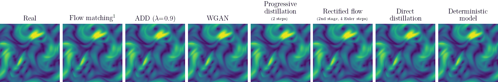
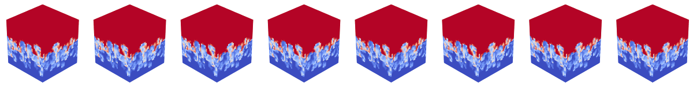

# Efficient probabilistic surrogate modeling techniques for partially-observed large-scale dynamical systems

This repository contains the codebase for [the following paper](https://arxiv.org/abs/2511.04641):
```
@article{harder2025efficient,
  title={Efficient probabilistic surrogate modeling techniques for partially-observed large-scale dynamical systems},
  author={Harder, Hans and Vishwasrao, Abhijeet and Guastoni, Luca and Vinuesa, Ricardo and Peitz, Sebastian},
  journal={arXiv preprint arXiv:2511.04641},
  year={2025}
}
```

>**Abstract**: This paper is concerned with probabilistic techniques for forecasting dynamical systems described by partial differential equations (such as, for example, the Navier-Stokes equations). In particular, it is investigating and comparing various extensions to the flow matching paradigm that reduce the number of sampling steps. In this regard, it compares direct distillation, progressive distillation, adversarial diffusion distillation, Wasserstein GANs and rectified flows. Moreover, experiments are conducted on a set of challenging systems. In particular, we also address the challenge of directly predicting 2D slices of large-scale 3D simulations, paving the way for efficient inflow generation for solvers.

Accordingly, this repository implements
- conditional flow matching models,
- adversarial diffusion distillation,
- Wasserstein GANs,
- progressive distillation,
- rectified flows,
- and direct distillation.

We have conducted experiments on three datasets, one is a downsampled version of the 2D Navier-Stokes equations, the other two are based on sliced/downsampled simulations of the 3D Rayleigh-Taylor instability:




¹Flow matching ODE solved with 20 midpoint steps.


## Installation & directory structure

In the top level directory, run

    pip install -e .

this installs an editable version of this project.
The directory structure is as follwos:


```
    |- src
        |- fmfts
            |- datasets
                (here the datasets are stored, see below)
            |- dataloader
                <experiment>.py             // loads & visualizes <experiment> dataset
            |- experiments
                trainer.py                      // script for training
                print_trained_model_stats.py    // prints properties of all trained models
                trainer.sh                      // shell script that calls trainer.py
                |- <experiment>
                    |- runs                 // contains data from tensorboard
                    |- checkpoints          // contains trained models w/ timestamp
                    |- trained_models       // contains the trained models
                    models.py               // contains model classes
                    training_parameters.py  // parameters for training
                    visualization.ipynb     // notebook that visualizes trained models
            |- tests                        // some scripts that check if the utilities work
            |- utils
                |- models
                    add.py                  // adversarial diffusion distillation
                    cfm_dir_dist.py         // direct distillation
                    cfm_prog_dist.py        // progressive distillation
                    cfm_rectifier.py        // rectified flows
                    cfm_velocity.py         // conditional flow matching velocity model
                    deterministic.py        // deterministic model
                    time_series_model.py    // abstract base class for time series prediction
                padding.py                  // defines flexible padding functionality
                unet.py                     // custom UNet class

```

## Simulation data

- [Compressible Navier-Stokes equations](https://drive.google.com/drive/folders/1IZ7tsLdnoQvchVx9RZq3__d5RBm7gSvc?usp=drive_link) (<0.5GB, extracted from [PDEBench](https://arxiv.org/abs/2210.07182))
- [Rayleigh-Taylor instability](https://polymathic-ai.org/the_well/datasets/rayleigh_taylor_instability/) (>200GB, from [The Well](https://proceedings.neurips.cc/paper_files/paper/2024/hash/4f9a5acd91ac76569f2fe291b1f4772b-Abstract-Datasets_and_Benchmarks_Track.html) ). Can be downloaded using the [tutorial instructions](https://polymathic-ai.org/the_well/tutorials/dataset/).

Download the data & place the files such that the directory structure is as follows:

```
    |- src
        |- fmfts
            |- datasets
                |- ns2d
                    |- ns2d_data_test.pt
                    |- ns2d_data_train.pt
                |- rti3d
                    |- test
                        |- rayleigh_taylor_instability_At_25.hdf5
                        |- rayleigh_taylor_instability_At_50.hdf5
                        |- rayleigh_taylor_instability_At_75.hdf5
                        |- rayleigh_taylor_instability_At_125.hdf5
                        |- rayleigh_taylor_instability_At_0625.hdf5
                    |- train 
                        |- rayleigh_taylor_instability_At_25.hdf5
                        |- rayleigh_taylor_instability_At_50.hdf5
                        |- rayleigh_taylor_instability_At_75.hdf5
                        |- rayleigh_taylor_instability_At_125.hdf5
                        |- rayleigh_taylor_instability_At_0625.hdf5
```


### Training models

This can be done by executing the scripts `trainer.py` or `trainer.sh` in the `src/fmfts/experiments` section. The `trainer.py` script provides some outputs. For better visualization, we have also implemented some [tensorboard functionality](https://docs.pytorch.org/docs/stable//tensorboard.html) that tracks the training process. Visualize the training by running

    tensorboard --logdir <experiment>/runs

